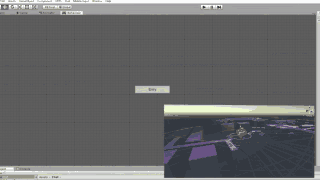

Unity version 2022.3.14f1

# Eliot-AI

**Unity | C# | Editor Extension | NPC | Visual Scripting**

Eliot AI is a <em>next generation cutting edge tool to create lightning fast high quality artificial intelligence for your game!</em> From simple <strong>FPS</strong> games to full blown <strong>boss battles</strong>, Eliot AI can get you up and running <em>saving you weeks and months</em> trying to code all your AI on your own!  Our state of the art <strong>Behaviour Designer</strong> gives you a visual way to create powerful robust Artificial Intelligence for your game!

<strong>Come see why Eliot AI has quickly become a top solution for games and download your copy today!!</strong>

 
 

<a href = "https://docs.google.com/document/d/1_5svPcnkMDTVhkybuDIbixjy3pUUEYBdthTVyiIDmzc/edit?usp=sharing">
<strong>DOCUMENTATION</strong>
</a>
|
 <a href = "https://www.youtube.com/channel/UCOZeavQpk9NZuL6NzECMmGw">
<strong>YOUTUBE </strong>
</a>
 

 
 
<strong>⭐ Features and Functionality ⭐</strong>
 
 

◽ Build powerful AI behaviours without writing a single line of code (with our powerful Behaviour Designer) 

◽ Get a live visual display of your AI in action within the Behaviour Designer

◽ World Famous 5 Minute AI Integration (Watch the YouTube Video tutorial)

◽ Your AI characters can see the world around them with powerful built in Perception

◽ Using Unity’s built-in NavMesh system AI characters can navigate the world you’ve created

◽ Easy animation setup. Works with both Mecanim and Legacy animations. Basic Animator Controller included.

◽ You can set up any Resources (Health, Energy, Magic, etc.) for your characters and bind them with a variety of characters’ actions

◽ You have an option to control your characters fully or share the control with the Behaviour

◽ Comes with a pack of starting behaviours to get you up and running FAST! (7 Starting Behaviours to Work With)

◽ Modular reusable Skills that allow your characters to interact with the world and with each other in a variety of ways

◽ Comes with a pack of starting skills (8 Starting Skills to Work With)

◽ Procedural attributes. Add new variables to your Agents without a single line of code

◽ Powerful new Welcome Window showcasing Eliot Tutorials and Documentation 

◽ <strong>Inventory System:</strong> Your characters can pick up and use items, like potions, weapons etc with our powerful built-in Inventory System

◽ Multiple options for Perception to fit your purposes better (2D Perception, second perception, distance-based perception and more)

◽ Your characters are capable of dodging as an addition to the rest of the Motion features

◽ Easily bind your Resources (e.g. energy) with Motion to simulate tiredness 

◽ Ability to use Unity Events to control your characters by binding any keys to actions without having to code 

◽ Our Powerful <strong>Utility AI</strong> System within the Eliot Graph 

◽ <strong>Finite State Machines</strong> within the Eliot Graph 

◽ Custom Parameters within Behaviours and Interfaces. Behaviours are now even more reusable and customizable 

◽ Control Animation within the Behaviours. 

◽ Character Wave Generation and Pooling Handler 

◽ Unlimited Skills

◽ Unlimited Key-Skill Bindings 

◽ Turret option capability for Motion 

◽ Patrol Functionality for Motion

◽ Perception Mask Filtering Capabilities. Increase performance by using physics layers

◽ Ability to reuse your characters’ objects upon death as an alternative to reinstatiating them every time

◽ Advanced Behaviour Functionality (Run Away, Walk Away, Patrol, Dodge, Etc.) 

◽ Pro Interface DARK Skins and High End UI 
